# SE(2) A* Path Planner for Go2

Discrete grid-based A* planner over SE(2) (x, y, theta) with velocity controller output for the Unitree Go2 robot.

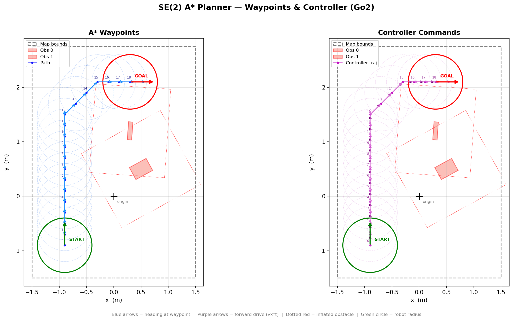

## Files

```
planner.cc    A* planner + controller + socket viz
planner.cfg   Static config (map, grid, robot, tolerances)
query.cfg     Dynamic config (start, goal, obstacles)
visualize.py  Socket-based matplotlib visualization
Makefile      Build & run
```

## Quick Start

```bash
# Edit query.cfg with your start, goal, and obstacles, then:
make run
```

Compiles `planner.cc`, launches `visualize.py` in background, runs the planner which streams results to the visualizer over TCP.

## Config

### `planner.cfg` — Static

| Key | Description |
| --- | --- |
| `x_min/max`, `y_min/max` | Map bounds (metres) |
| `dx`, `dy`, `n_theta` | Grid resolution |
| `robot_radius` | Collision radius |
| `safety_margin` | Extra inflation |
| `goal_tol` | Goal tolerance (Euclidean, metres) |
| `step_time` | Seconds per control step |
| `viz_port` | TCP port for visualizer |
| `delta_x/y/theta` | Post-planning offset |

### `query.cfg` — Dynamic (edit per run)

| Key | Description |
| --- | --- |
| `start_x/y/theta` | Start pose |
| `goal_x/y/theta` | Goal pose |
| `obs.N.x/y/theta/length/width` | Obstacle N (oriented rectangle) |

## Controller

Each path segment produces a velocity command:

| Field | Description |
| --- | --- |
| `vx` | Forward velocity (m/s) along heading |
| `vy` | Lateral velocity (always 0, unicycle) |
| `vtheta` | Angular velocity (rad/s) |
| `duration` | Hold time (s) |

Replace `SetMotion()` with your Go2 SDK call.

## Usage

```bash
make                # compile only
make run            # compile + visualize + plan
make clean          # remove binary + images
./astar --no-viz    # plan without visualization
./astar --execute   # plan + execute SetMotion() per step
./astar --config <path> --query <path>
```

## Gallery

Tested across 10 scenarios with 0–5 obstacles, varying start/goal headings and layouts.

| | |
| --- | --- |
| 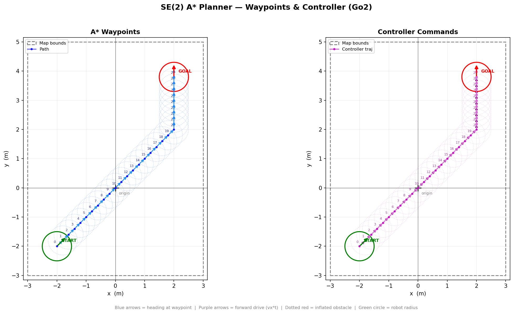 | 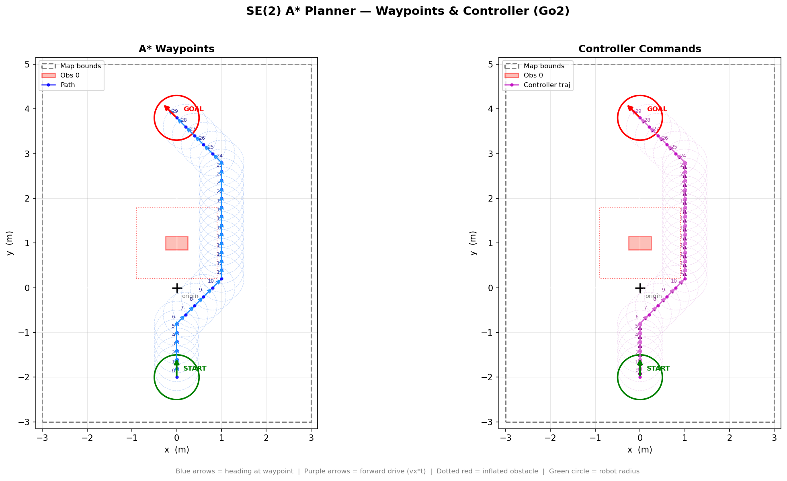 |
| No obstacles | Single obstacle |
| 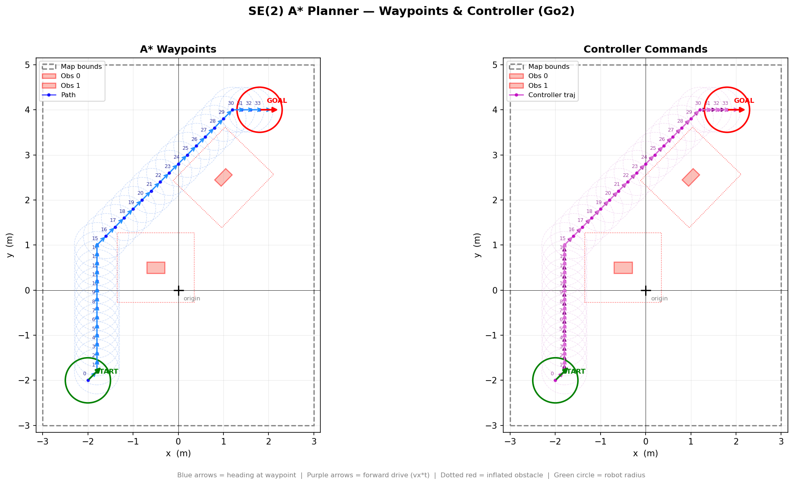 | 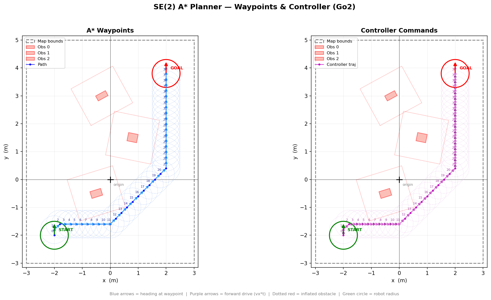 |
| Two obstacles — corridor | Three obstacles — slalom |
| 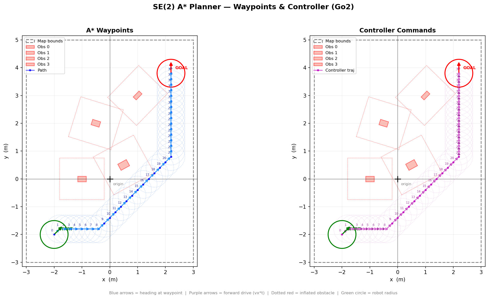 | 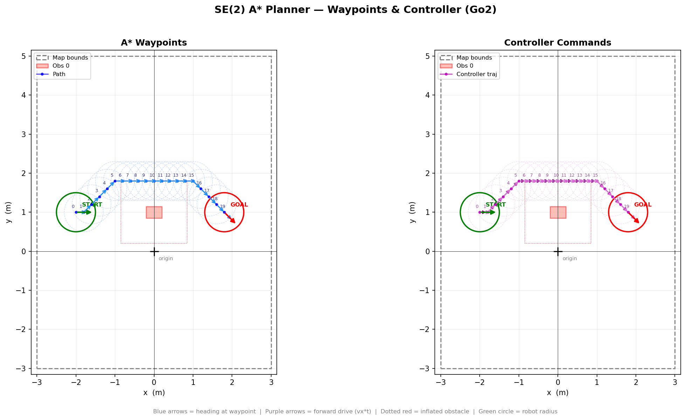 |
| Four obstacles — dense | Goal behind obstacle |
| 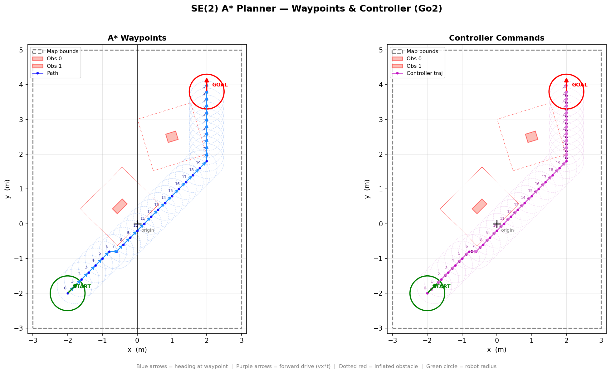 | 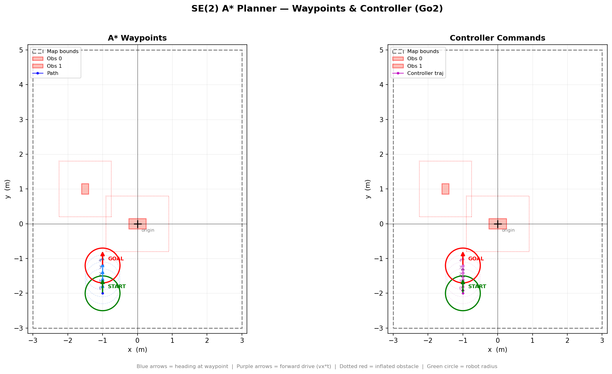 |
| Diagonal traverse | U-turn |
| 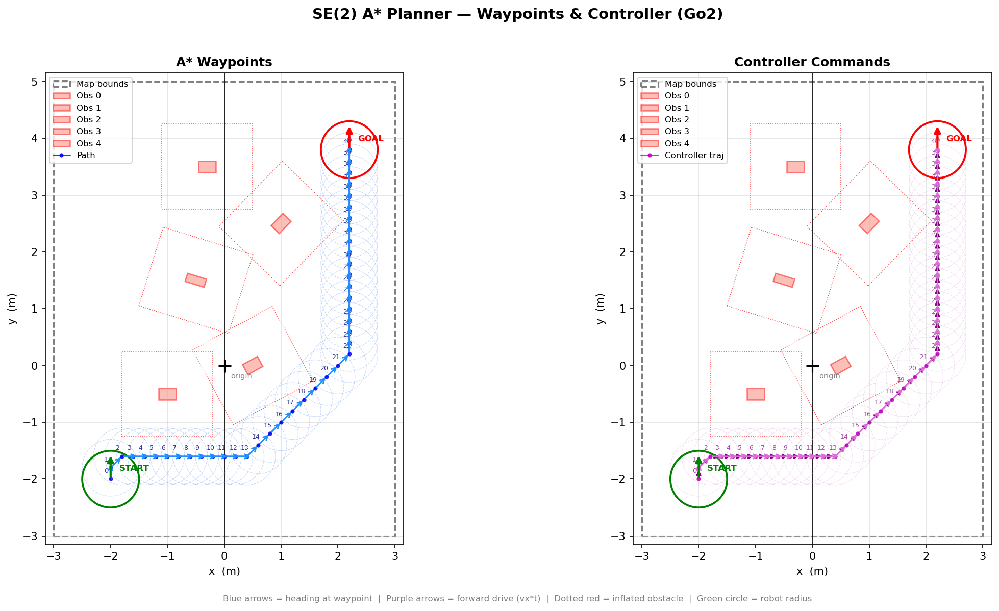 | 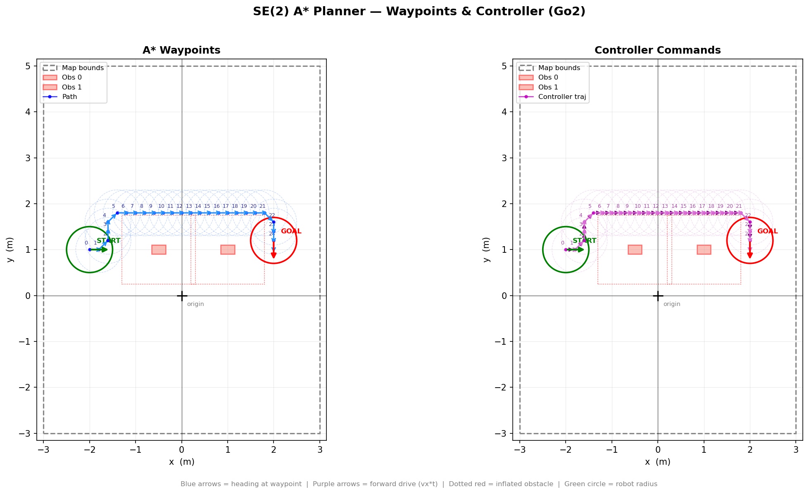 |
| Five obstacles — course | Lateral dodge |
